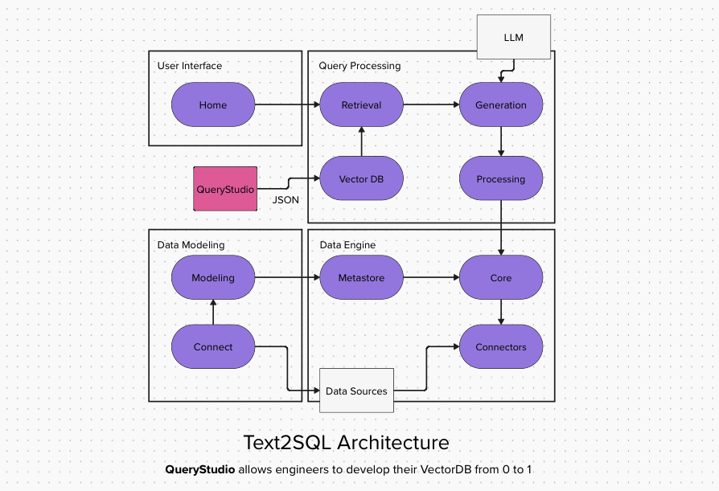

# Otacta QueryStudio - A Text-To-SQL Implementation

## What is QueryStudio?

🚀 QueryStudio is fully open-source. Star the repo, contribute, and help shape the future of AI-powered SQL automation!

QueryStudio is an open-source automation tool that helps AI teams generate high-quality structured SQL training datasets, metadata mappings, and Chain-of-Thought (COT) reasoning for Text-to-SQL (T2SQL) AI models.

It is not a full Text-to-SQL solution but rather a key framework component that accelerates the development of such systems by automating and standardizing the most time-consuming parts of model training and fine-tuning.

By reducing manual effort and ensuring consistency, QueryStudio enables AI engineers, data scientists, and researchers to fast-track the deployment of Text-to-SQL AI systems.

### The Problem: Why Do We Need QueryStudio?

Building Text-to-SQL AI models is difficult—not because the AI doesn’t work, but because the foundation needed to support it is inefficient, inconsistent, and fragmented.

Many teams have attempted to build Text-to-SQL solutions, but most projects:
- Get stuck in POC mode due to a lack of structured dataset preparation.
- Struggle with consistency in SQL query generation, metadata mapping, and validation.
- Require excessive manual effort to map schema relationships, generate SQL pairs, and refine LLM prompts.
- End up reinventing the wheel, using different internal methods that slow down productionization.

### Why is this a critical issue?

- LLMs don’t "understand" SQL inherently—they rely on structured examples to make accurate predictions.
- Manually curating these training datasets is slow, expensive, and inconsistent across projects.
- Without standardized datasets, scaling Text-to-SQL AI remains inefficient and unpredictable.

💡 QueryStudio solves this by automating query generation, metadata referencing, and COT structuring—helping AI teams accelerate development while improving accuracy and reliability.
💡 Instead of spending weeks manually curating SQL training data, QueryStudio enables teams to bootstrap high-quality structured datasets in minutes.

### Where Does QueryStudio Fit?

QueryStudio is not a Text-to-SQL pipeline itself but a tool that allows developers to:

✔ LLM Training Pipelines – generate high-quality SQL-COT datasets for AI model fine-tuning.
✔ Prompt Engineering Workflows – generate synthetic examples based on existing database for few-shot strategies.
✔ Retrieval-Augmented Generation (RAG) Systems – Pre-caching validated SQL examples to improve query efficiency.
✔ Enterprise AI & MLOps Pipelines – Automating SQL-related AI dataset preparation for internal AI teams.

💡 If you're building a Text-to-SQL model, QueryStudio acts as a data layer that speeds up training, improves query accuracy, and ensures structured consistency.

## Getting Started
- Clone the repository: `git clone git@github.com:otacta/query-studio-internal.git` or `https://github.com/otacta/query-studio-internal.git`
- Follow the instructions in the `docs/SETUP.md` to configure your environment and dependencies.
- A walkthrough on how to use QueryStudio can be found in `docs/notebooks/query_studio.ipynb`.

## Contribution Guidelines
We welcome contributions from the community. Please follow these steps:
1. Fork the repository.
2. Create a new branch for your feature or bugfix.
3. Commit your changes with descriptive messages.
4. Submit a pull request for review.

## Future Roadmap (v1.1 and Beyond)

### Upcoming Features
🚀 Pre-cached SQL storage for efficient query execution
🚀 Integration with retrieval-augmented generation (RAG) pipelines
🚀 Enterprise-ready deployment enhancements
🚀 UI/UX streamlining via a lightweight web interface

### What QueryStudio is NOT (Yet)
- A full-fledged Text-to-SQL model – QueryStudio is a data preparation and automation tool, not an inference engine.
- A direct competitor to RAG-based or vectorized Text-to-SQL retrieval – But it can integrate with such systems.
- An enterprise-ready, production-deployed solution – It is an open-source framework component, designed to be customized and extended by AI teams.

(For now, QueryStudio is a Jupyter-based tool, but planned enhancements will improve usability for AI teams.)

## ✉️ Connect with Us – Let’s Build Together!
We’re excited to collaborate with the AI & Data Science community to push the boundaries of Text-to-SQL automation!

- Have feedback, feature suggestions, or want to discuss Text-to-SQL?
- Looking to contribute or explore enterprise-level solutions?

**Reach out to us via:**
- GitHub Discussions – Start a thread in Discussions (https://github.com/otacta/query-studio/issues)
- Email Us – admin@otacta.com
- Join the Community – Engage with us on LinkedIn

🚀 We’d love to hear your thoughts, collaborate on improvements, and see how QueryStudio helps your AI & ML projects!
